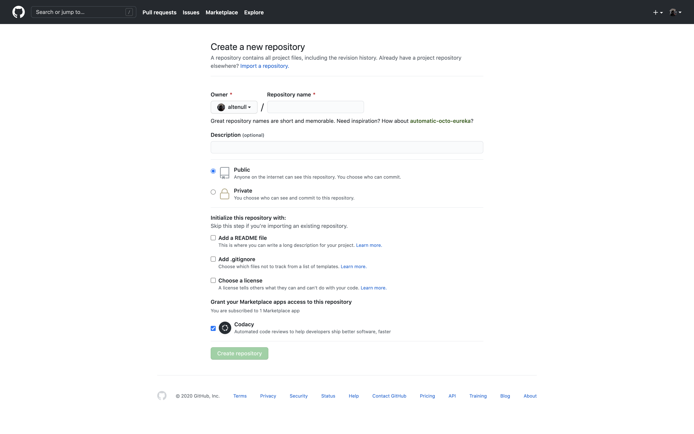
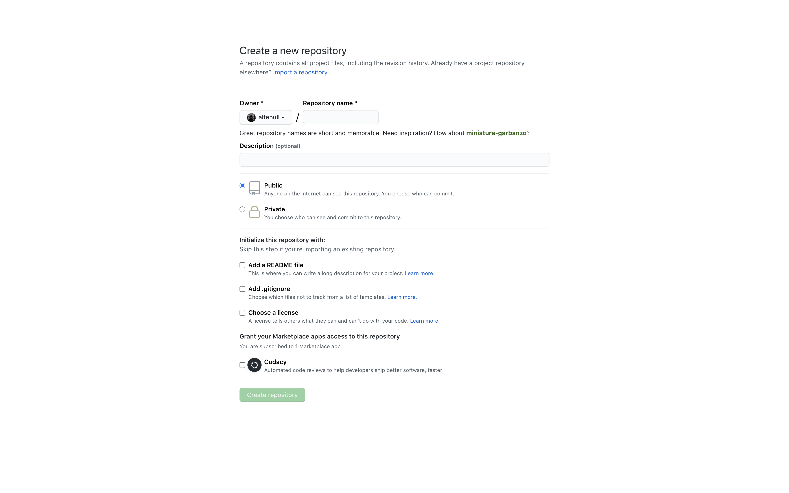

# Simple Publish

| This is a small publishing job to clone main part of https://github.com/new **without frameworks or libraries**.

## Publishing Target

  

## Result

Here's a link for the result: https://simple-publish.netlify.app/

  

